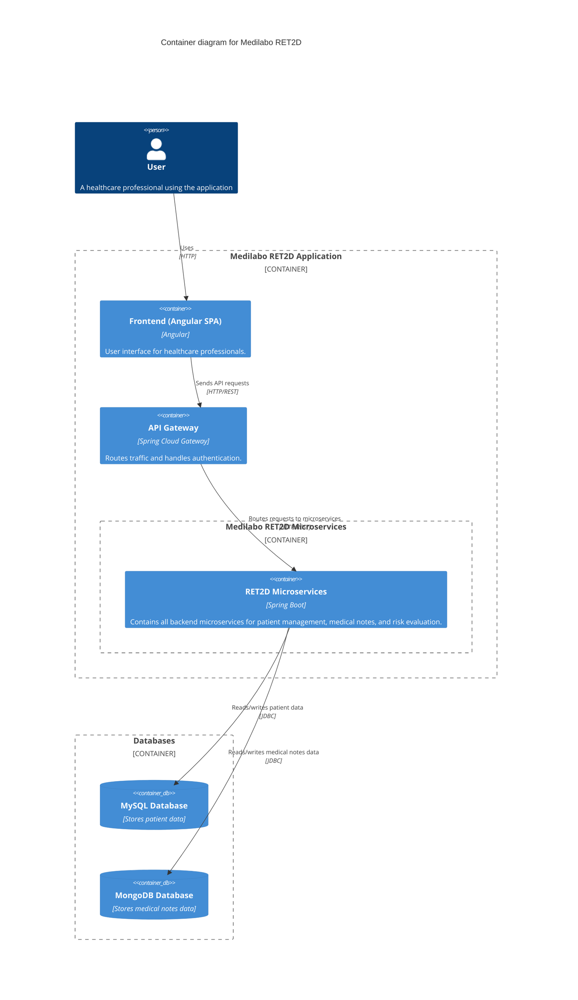
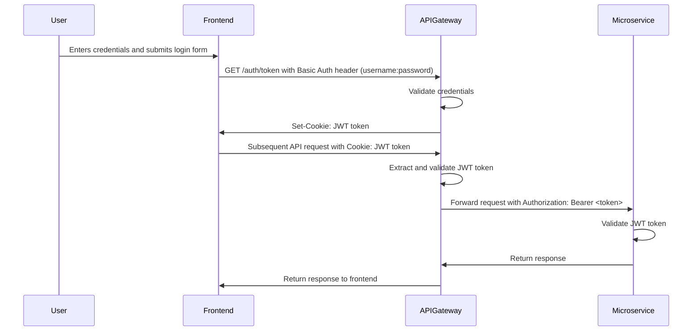

# Medilabo - Risk Evaluator for Type 2 Diabetes (RET2D)

_Medilabo_ **RET2D** is a microservices-based application designed to assess the risk of Type 2 Diabetes in patients
based on personal+ data and medical notes.

The system is composed of a frontend web application, an API Gateway, and several backend microservices, each
responsible for a specific business capability. The architecture follows a distributed, REST-based design with clear
separation of concerns and independent persistence layers.

---

## 📌 Project Overview

_Medilabo_ **RET2D** allows healthcare professionals to:

- Manage patient information
- Store and retrieve medical notes
- Evaluate diabetes risk level based on predefined business rules
- Secure API access using JWT authentication

The application demonstrates a clean microservices architecture using Spring Boot and a modern frontend framework.

---

## 🏗️ Architecture

The system is structured as follows:

- **Frontend** (Angular SPA - _Single Page Application_)   
  User interface consuming the backend REST API through the **API Gateway**.

- **API Gateway** (Spring Cloud Gateway)  
  Single entry point for all client requests.  
  Acts as:
    - An authentication layer, validating JWT tokens and enforcing security policies.
    - A reverse proxy, forwarding requests to the appropriate microservices.

- **Patient Microservice**
    - Manages patient personal data
    - Persists data in MySQL
    - Exposes REST endpoints

- **Medical Note Microservice**
    - Manages patient medical notes
    - Persists data in MongoDB
    - Exposes REST endpoints

- **Risk Evaluator Microservice**
    - Computes diabetes risk level
    - Aggregates data from Patient and Medical Note microservices
    - Uses OpenFeign to consume internal APIs



---

## 🧰 Tech Stack

### Backend

- **Java** 21+
- **Spring Boot** ecosystem:
    - Spring Web (MVC)
    - Spring Data JPA (MySQL)
    - Spring Data MongoDB
    - Spring Cloud Gateway (WebMVC)
    - OpenFeign
    - Spring Security
- **JWT** authentication
- **Maven**

### Frontend

- Node.js 24+
- Angular 20+
- TypeScript
- Bootstrap 5

### Databases

- **MySQL**: used by the _Patient_ microservice to store patient personal data
- **H2** _(in-memory database)_: used for testing and development in the _Patient_ microservice
- **MongoDB**: used by the _Medical Note_ microservice to store unstructured medical notes
    - **Testcontainers** will be used for integration testing in the _Medical Note_ microservice

### Infrastructure

- **Docker**: containerization of all services
- **Docker Compose**: orchestration of multi-container application

---

## 🔐 Security workflow

Authentication is based on **Basic** Auth & **JWT** tokens.

- Users authenticate via the API Gateway, which issues a JWT token stored within cookies upon successful login.
- The Gateway extracts JWT from cookies and validates tokens before routing requests.
- Microservices validate JWT signatures using a shared secret/issuer configuration.
- Access to protected microservice's endpoints requires a valid `Authorization: Bearer <token>` header.



---

## 🚀 Getting Started

### Prerequisites

- Java 21+
- Maven (_MVN Wrapper_ is included on each microservice)
- Node.js 24+
- Docker (using Docker Compose)

### ↘️ Clone the repository

```bash
  git clone https://github.com/Steezycoding/medilabo.git
```

### 🛠️ Developing and testing

Please refer to the [CONTRIBUTING.md](./docs/CONTRIBUTING.md) file for detailed instructions on how to set up the
development environment, run
individual microservices, and execute tests.

### ▶️ Running the application (Docker)

The easiest way to run the built application is via Docker Compose:
> Ensure you have **Docker daemon running** and **Docker Compose installed** on your machine.

Then, from the **root directory of the project**, execute:

```bash
  docker compose up -d
```

Frontend will be available at http://localhost:8080.

The default credentials for authentication are:

- Username: `user`
- Password: `user`

## 🍃 Green Code

Please refer to the [Green Code (EN)](./docs/green-code/green_code_en.md) guidelines for best practices on writing
clean, maintainable, and efficient code within this project.

French version: [Green Code (FR)](./docs/green-code/green_code_fr.md)