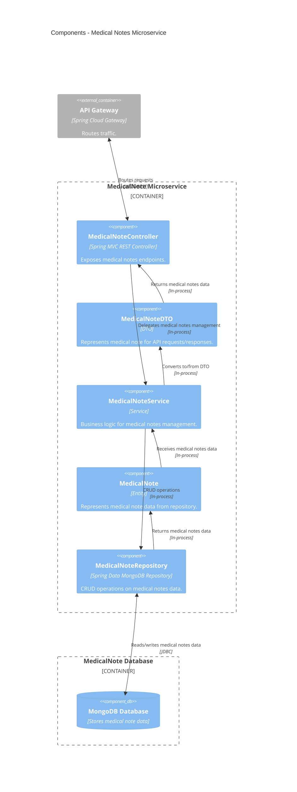

# Medical Note Microservice - Medilabo

## 📌 Overview

This microservice stores and retrieves medical notes associated with medical notes data (CRUD) and exposes a REST API.  
It is backed by a MongoDB database for persistence.

## 🧰 Tech Stack

- Language: **Java** 21
- Framework: **Spring Boot** (Web, Security), **Spring Cloud OpenFeign** for inter-service calls
- Build: **Maven** (MVN Wrapper included)
- Miscellaneous: **Lombok** for boilerplate reduction, **Jackson** for JSON processing
- Testing: **JUnit** 5

## Architecture



## ▶️ Running app

### Local (development)

Please refer to the _Running services locally (development)_ from [CONTRIBUTING.md](../docs/CONTRIBUTING.md) guide for
running the microservice locally.

### Docker

From the **repository root**, you can build and run the microservice using Docker Compose:

```bash
  docker compose up -d medical-note-microservice
```
