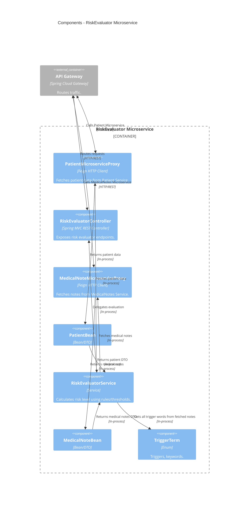

# Risk Evaluator Microservice - Medilabo

## 📌 Overview

The Risk Evaluator microservice calculates patient risk scores by aggregating patient personal data and medical notes.  
It fetches patient data and medical notes from the other microservices and computes risk levels based on triggers.  
It exposes HTTP endpoints for on-demand evaluation.

## 🧰 Tech Stack

- Language: **Java** 21
- Framework: **Spring Boot** (Web, Security), **Spring Cloud OpenFeign** for inter-service calls
- Build: **Maven** (MVN Wrapper included)
- Miscellaneous: **Lombok** for boilerplate reduction, **Jackson** for JSON processing
- Testing: **JUnit** 5

## 🏗️ Architecture



## ▶️ Running app

### Local (development)

Please refer to the _Running services locally (development)_ from [CONTRIBUTING.md](../docs/CONTRIBUTING.md) guide for
running the microservice locally.

### Docker

From the **repository root**, you can build and run the microservice using Docker Compose:

```bash
  docker compose up -d risk-evaluator-microservice
```

## 🧪 Testing app

To run tests for this microservice, you can use the following command from the **module root**:

```bash
  ./mvnw clean verify site
```

This will execute all tests and generate a test report and project information in the `target/site` directory.  
You can open the `index.html` file in that directory to view these information.
